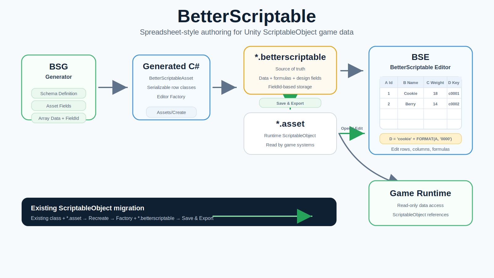
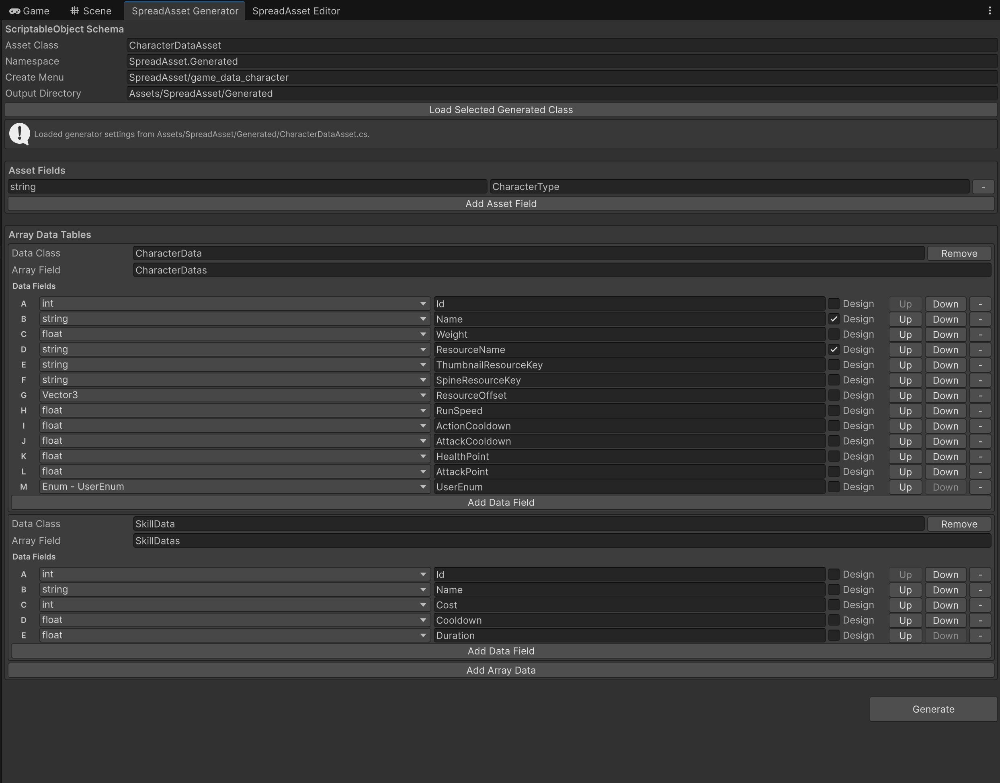
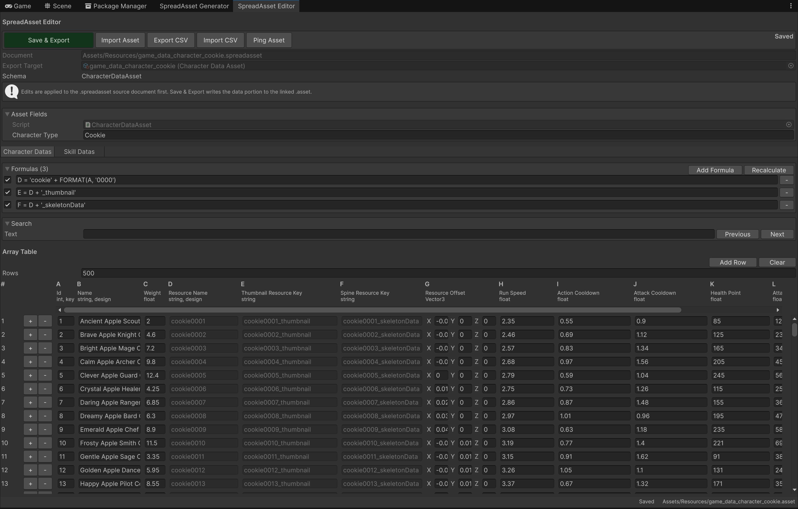

# BetterScriptable

[Korean guide](README.ko.md)

BetterScriptable is a Unity utility asset for making ScriptableObject-based game data easier to inspect, compare, and edit.

ScriptableObjects are native to Unity and convenient for small data sets, but the default Inspector is awkward when designers or programmers need to compare many rows of data at once. BetterScriptable keeps the runtime advantages of ScriptableObjects while adding spreadsheet-style authoring for array data.

BetterScriptable uses two files as a pair:

- `*.betterscriptable`: the authoring source document. It stores serialized data, formulas, design-only cells, and sheet metadata.
- `*.asset`: the exported runtime ScriptableObject. Game systems should read this file.

Use `Save & Export` in the BetterScriptable Editor to save the source document and update the linked runtime asset.

## Project Overview



## Screenshots





## Repository Layout

```text
BetterScriptable Unity project
├── Assets/
│   ├── BetterScriptable/
│   └── Resources/
├── Packages/
│   └── com.rewuio.betterscriptable/
│       ├── Runtime/
│       ├── Editor/
│       ├── Tests/
│       ├── Documentation~/
│       └── Samples~/
├── ProjectSettings/
└── AGENTS.md
```

## Development Notes

- Unity version: Unity 6.4 (`6000.4.5f1`).
- Main package: `Packages/com.rewuio.betterscriptable`.
- Runtime namespace: `BetterScriptable`.
- Editor namespace: `BetterScriptable.Editor`.
- New reusable source should live in the package, not directly under `Assets/`.

## Main Editor Tools

- `Tools > BetterScriptable > Generator`: creates ScriptableObject data classes and Editor-only factory code.
- `Tools > BetterScriptable > Open`: opens the BetterScriptable Editor window.
- `Assets/Open in BetterScriptable Editor`: opens a selected `.betterscriptable` file from the Project window.
- `Assets/BetterScriptable/Recreate Document From Asset`: creates a BetterScriptable document and factory from an existing ScriptableObject asset.

## Workflow 1: Starting With BetterScriptable

Use this path when you are creating a new data type and want BetterScriptable to generate the ScriptableObject class for you.

1. Open `Tools > BetterScriptable > Generator`.
2. Enter the asset class name, such as `ItemDataAsset` or `CharacterDataAsset`.
3. Set the create menu path, such as `BetterScriptable/game_data_item`. This becomes an `Assets/Create/...` menu.
4. Add asset fields for single values on the asset, such as `ItemCategory` or `CharacterType`.
5. Add array data definitions for table-like data:
   - `Row Type Name`: the serializable row class, such as `ItemData`.
   - `Field Name`: the array field on the asset, such as `ItemDatas`.
   - Data fields: columns such as `Id`, `Weight`, `RunSpeed`, or `ResourceKey`.
6. Mark a field as a design field when it should be visible in the BetterScriptable spreadsheet but should not be exported into the runtime `.asset`.
7. Use the up/down buttons in the Generator to arrange data field order. This order becomes the column order in BSE.
8. Click `Generate`.
9. Wait for Unity to compile the generated scripts.
10. Use the generated `Assets/Create/...` menu to create a paired `.betterscriptable` document and `.asset`.
11. Select the `.betterscriptable` file, or open it with `Tools > BetterScriptable > Open`.
12. Edit asset fields, formulas, and array rows in the BetterScriptable Editor.
13. Click `Save & Export`.

After export, the `.betterscriptable` file remains the source of truth. The linked `.asset` is the runtime output.

## Workflow 2: Recreating From Existing ScriptableObjects

Use this path when your project already has a ScriptableObject class and `.asset` data, and you want to start managing that data with BetterScriptable.

1. Select the existing `.asset` file in the Unity Project window.
2. Right-click and choose `BetterScriptable > Recreate Document From Asset`.
3. BetterScriptable reads the selected ScriptableObject type and serialized data.
4. A `.betterscriptable` document is created next to the selected `.asset`.
5. If BetterScriptable cannot find an existing generated schema, it creates a factory script beside the runtime script under an `Editor` folder.
6. The recreated document opens in the BetterScriptable Editor.
7. Review the inferred fields and array tables.
8. Edit data in BSE and click `Save & Export` when ready.

The recreate flow is intended for migration. It preserves the existing `.asset` as the linked runtime output and creates the missing BetterScriptable authoring document.

The schema is inferred from serializable fields. Simple serialized fields become asset fields. Array or list fields with serializable row types become spreadsheet tables. After recreation, you can refine the generated factory/schema if you need design-only fields, renamed columns, or a different create menu path.

## Editing In BSE

The BetterScriptable Editor shows three major areas:

- `Asset Fields`: non-array serialized fields, similar to Unity's Inspector.
- `Formulas`: formulas for the selected array table.
- `Array Table`: spreadsheet-style rows and columns for the selected array field.

If an asset has multiple array fields, the tabs above `Formulas` switch which table is currently being edited.

Array table behavior:

- Columns are labeled `A`, `B`, `C`, and continue as `AA`, `AB`, `AC`.
- Rows start at `1`.
- The row number area and column header stay visible while scrolling.
- Use normal mouse wheel scrolling for vertical movement.
- Use `Shift + mouse wheel` for horizontal movement.
- Use `Tab` to move to the next cell in the same row.
- Use `Enter` to move to the same column in the next row.

## Formulas

Formulas can target a whole column or a single cell.

Examples:

```text
C = A + B
C1 = A1 + B1 + 300
D = C + '_key'
D = 'cookie' + FORMAT(A, '0000')
```

Column formulas apply to every row in that column. Cell formulas have higher priority than column formulas, so `C1 = A1 + B1 + 300` overrides a broader `C = A + B` formula for row `1`.

Formula results are saved into the `.betterscriptable` source document and exported into the linked `.asset` when you click `Save & Export`.

## Updating Generated Schemas

When you need to revise a class generated by BetterScriptable:

1. Open `Tools > BetterScriptable > Generator`.
2. Select the generated asset script or generated factory script in the Project window.
3. The Generator reloads the previous schema settings.
4. Edit fields, data tables, design flags, or field order.
5. Generate again.

Existing `.betterscriptable` documents can refresh their schema and show newly added columns when opened in BSE.
